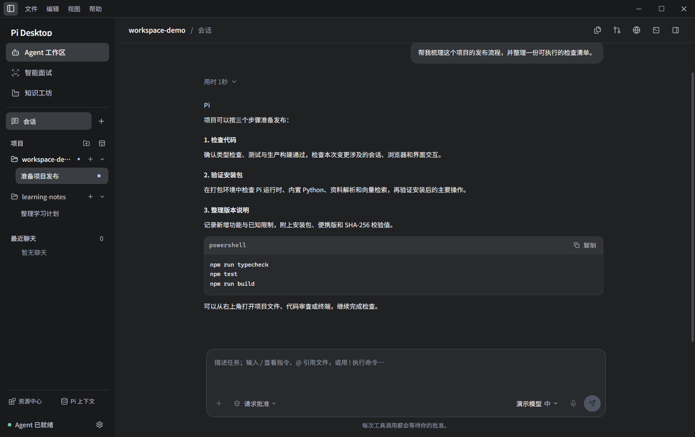
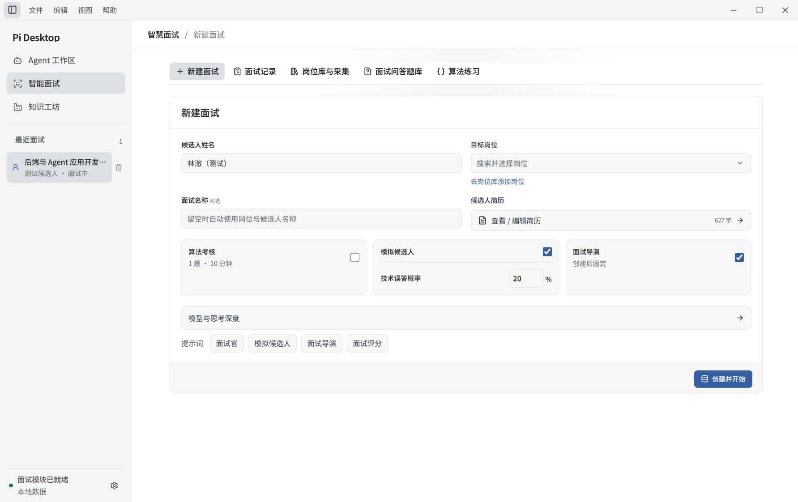
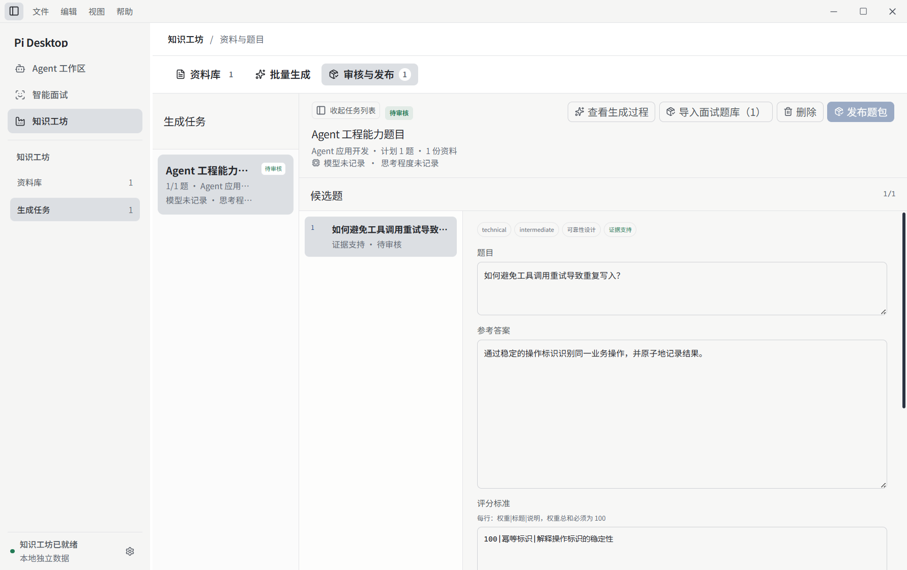

# Pi Desktop

**从项目协作，到模拟面试，再到知识沉淀。**

基于 Pi Agent 的桌面工作区，将代码与工具、面试练习和资料出题放在同一个客户端里。按项目管理工作会话，用自己的模型账号开始协作。

[查看 Release](https://github.com/WuJiaJun1020/myagent/releases) · [从源码运行](#从源码运行) · [客户端文档](pi-desktop-client/README.md)



> 截图由当前界面的真实组件配合虚构演示数据生成，不包含个人会话或密钥。

## 主要功能

| 模块 | 功能 |
| --- | --- |
| Agent 工作区 | 多项目与工作会话、独立聊天模式、流式回复、工具调用与审批、文件编辑、Git 差异审查、集成终端、资源中心与上下文管理 |
| 智慧面试 | 岗位库、新建面试、模拟候选人与面试导演、对话与评分、问答题库、算法练习与面试算法考核 |
| 知识工坊 | 导入文件、文本与网页，管理资料，批量生成题目，审核并发布到题库 |

- 统一的浅色 / 深色外观，支持简约灰、暖砂、雾蓝配色，以及强调色、字体和字号设置。
- 紧凑的会话过程展示、可展开工具详情、轮次导航和即时发送反馈。
- 内置浏览器，可在工作区打开网页、localhost 和本地 HTML，支持中文文件名。
- 算法编辑区使用 Monaco，支持代码编辑、补全、只读参考答案和 Python 运行判题。

当前仍在持续开发，语音输入尚未实现。

## 界面预览

### 智慧面试：围绕岗位准备、练习与复盘

选择目标岗位、填写简历，配置算法考核与模拟候选人；也可以进入问答题库或 Monaco 算法编辑器独立练习。



### 知识工坊：从资料到可审核的题目

导入文件、文本或网页，生成带参考答案、评分要点与来源依据的候选题目，再审核发布到题库。



## Windows 版

在 [Releases](https://github.com/WuJiaJun1020/myagent/releases) 查看已发布的 Windows x64 版本。若页面尚无版本，可先从源码运行。

| 文件 | 用途 |
| --- | --- |
| `Pi-Desktop-Setup-<版本>-x64.exe` | 安装版，可选择安装目录并创建快捷方式 |
| `Pi-Desktop-<版本>-x64.exe` | 便携启动版，无需安装；用户数据仍按应用默认位置保存 |
| `SHA256SUMS.txt` | 核对下载文件是否完整 |

安装包包含 Electron、Pi 运行时和算法判题所需的 Python，无需另装 Node.js 或 Pi。首次启动后，在 **设置 → 模型与 Agent** 配置自己的模型账号；在线模型需要网络，可能产生提供商费用。

当前 Windows 构建尚未进行代码签名，系统可能显示“未知发布者”。升级前建议备份所需的本地数据。

## 项目与会话

- **创建项目**：选择文件夹并保存在侧栏，空项目也能保留；项目顺序不会随点击变化。
- **进入会话**：点击项目下的工作会话，通过 Pi 原生机制恢复历史及所属目录，跨项目也不重启进程。
- **新建工作**：点击项目旁的 `＋` 在该目录创建会话；另一个空项目首次开始工作时会初始化 Pi 环境。
- **独立聊天**：纯聊天单独列出，不混入项目工作会话。

点击项目名称只展开列表，不会结束当前会话或重启 Pi。

## 当前边界

- 修改卡片比较当前项目目录内的任务前后快照；项目外文件及部分构建、依赖目录不在追踪范围内。
- 内置浏览器支持网页与本地 HTML 预览，目前没有多标签、下载管理和持久登录功能。
- 算法练习使用内置 Python；Monaco 尚未接入语言服务器或 AI 补全。
- 会话与业务数据保存在本机；调用模型时，相关提示词、消息或资料会发送到所配置的提供商，并非全离线处理。

## 仓库结构

```text
pi-agent/           Pi Agent 源码与运行时
pi-desktop-client/  Electron + React + TypeScript 客户端
```

客户端通过 `file:../pi-agent/packages/coding-agent` 使用仓库内的 Pi Agent，通过 Electron IPC 和 Pi RPC 连接界面与运行时。Pi Agent 来源为 [earendil-works/pi](https://github.com/earendil-works/pi)，原始说明和许可证保留在其目录中。

## 从源码运行

要求 Node.js 22.19.0 或更高版本。以下命令从仓库根目录执行：

```powershell
cd pi-agent
npm.cmd install --ignore-scripts
npm.cmd run hydrate:model-data
npm.cmd run build:offline

cd ..\pi-desktop-client
npm.cmd install --ignore-scripts
npm.cmd run dev
```

首次安装依赖和准备模型目录需要网络；`build:offline` 不代表初次安装全程离线。启动后在“设置 → 模型与 Agent”中配置模型提供商。

## 开发与构建

日常修改客户端，在 `pi-desktop-client/` 执行：

```powershell
npm.cmd run dev        # 开发启动
npm.cmd run typecheck  # 类型检查
npm.cmd test           # 单元与集成测试
npm.cmd run build      # 生产构建
```

只有修改 Pi Agent 源码时，才需要在 `pi-agent/` 重新执行 `npm.cmd run build:offline`。

Windows x64 打包在客户端目录执行 `npm.cmd run dist:win`（便携版）或 `npm.cmd run dist:win:setup`（安装版），产物位于 `pi-desktop-client/release/`。打包脚本会准备内置 Python 运行时；首次准备需要网络。

## 文档

- [客户端运行、配置与验收](pi-desktop-client/README.md)
- [前端界面注意事项](pi-desktop-client/AGENTS.md)
- [主题接入与界面验收](pi-desktop-client/docs/WORKSPACE_THEME_GUIDE.md)
- [界面优化设计记录](pi-desktop-client/docs/CLIENT_UI_REDESIGN_PLAN.md)
